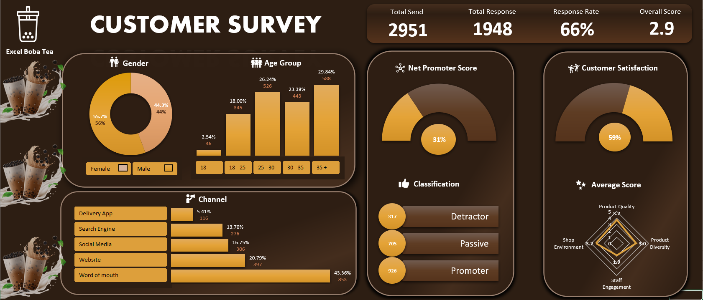

# Customer Survey Analysis - Using Excel, Power Query, Pivot Table

## Problem statement

Excel Boba Tea is a real estate company that has recently launched its new store and would like to launch more stores, but is not sure which way to go. To address this issue, they decide to evaluate the experience of their Shop customer before launching a new one. As a data analyst, my job is to create a customer survey, collect data from customers and extract meaningful insights to help Excel Boba Tea understand customer needs and opinions about their new store.

## Goal

My Goal is to create a relevant survey to collect information from customers, analyze dataset and create actionable metrics and visuals and design a user-friendly dashboard for Excel Boba Tea top-level management 
KPI's REQUIREMENT
**Total Send**: Number of people they send the survey to
**Total Response** : number of people who respond to the survey
**Response Rate**: the percentage of responses 
**Average Rating** : the average rating of product quality, variety, staff engagement, store environment
**CSAT** : Customer Satisfaction Score
**NPS** : Net Promoter Score

## Tools for the project

* Microsoft Forms for Data Collection
* Power Query for Data Transformation 
* Pivot Table and Chart for Analysis, Report and Visualization

## Insights

### Customers informations

1. Discovery Channels : To see the different channels through which customers find Excel Boba Tea
2. Gender : Number of men and women responding to the survey
3. Boba Tea Customer Age Segmentation :A look at different customer age segments

### Customers feedback

1. Net Promoter Score(NPS) : To see the customer's ability to recommend a product from Excel Boba Tea to their friends.
2. Customer Satisfaction (CSAT) : Pourcentage of customer satisfaction 
3. Average Rating of product & shop & Staff : Average ratings for product quality, variety, staff engagement and store environment

## Excel Dashboard  
